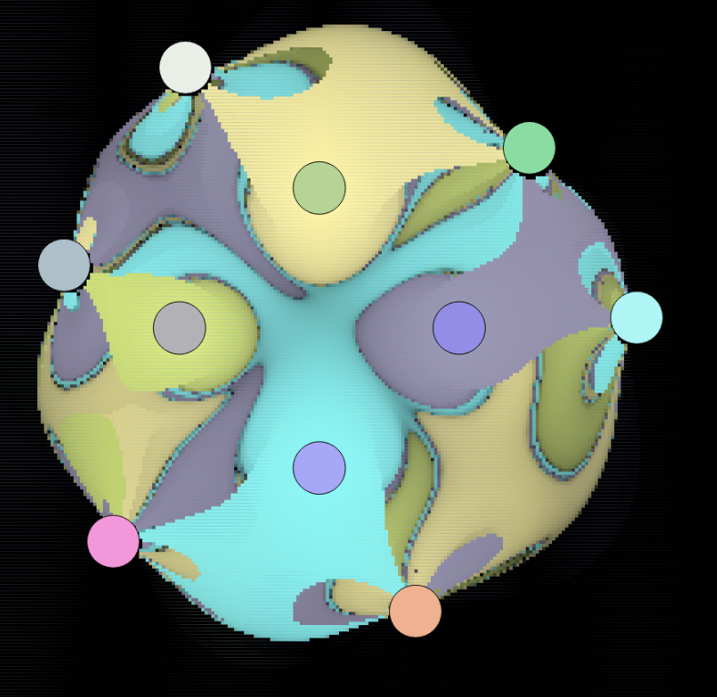
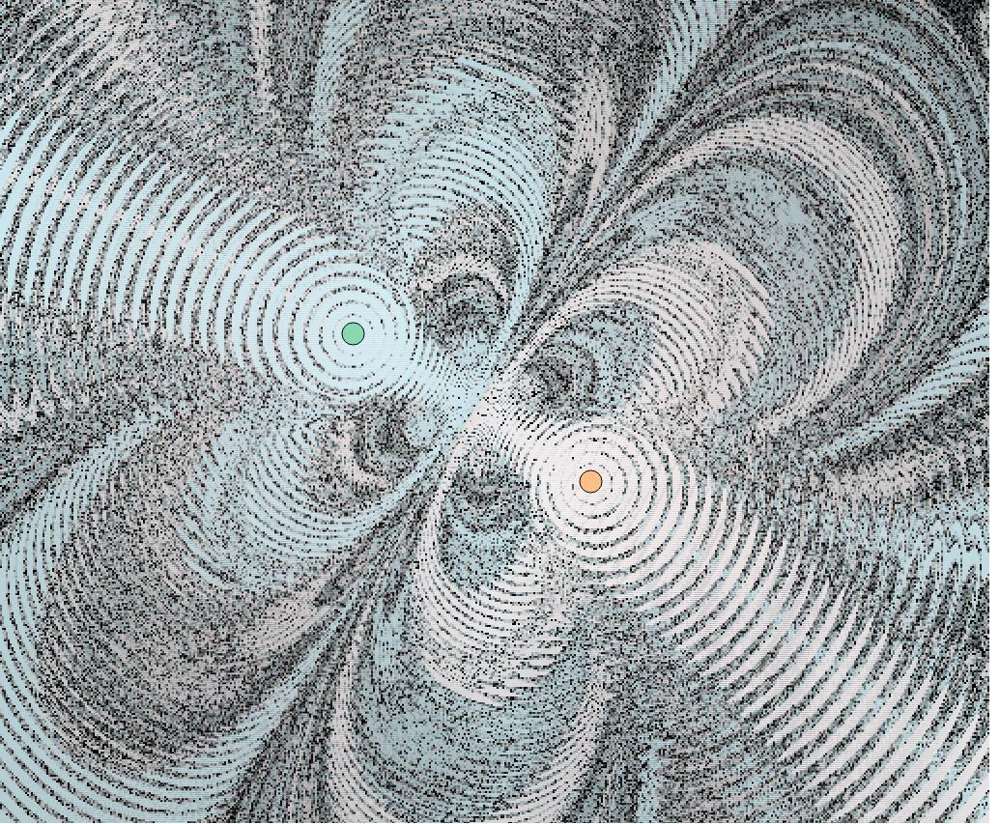
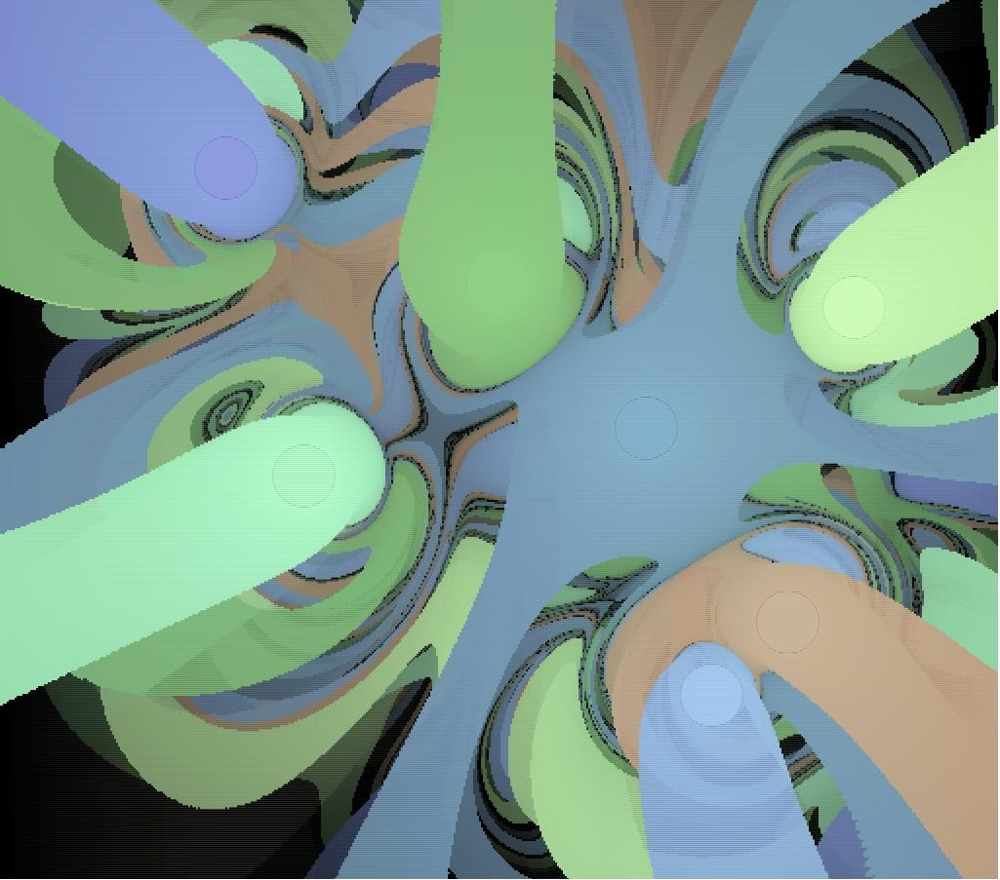

# A Physics-based fractal generator written in Rust and Wasm

## [Check out the demo here](https://justinleung.me/magnetic-fractals-wasm/)
**Note: If you see a white screen, try reloading the page. The page runs a [service worker](https://github.com/gzuidhof/coi-serviceworker) to enable [COOP/COEP](https://web.dev/coop-coep/) on Github pages, which is required for multithreaded rendering.**

## How it works

This app works by simulating the chaotic behavior of a magnetic pendulum. The pendulum is influenced by a **magnetic** force exerted by magnets around it, a **tension** force exerted by the rope that the pendulum hangs on (which pulls it towards the center), and (optionally) a **friction** coefficient which is proportional to the magnet's velocity. 

We can generate a fractal image by looping over each (x,y) coordinate the the 2D plane of the world, placing a pendulum at that coordinate, and running a simulation to determine which magnet that the pendulum lands on. Since it's possible that a pendulum does not land on a magnet for a very long time (or forever), we set a limit on the time taken (`max_iters`). We then colour the pixel associated to the coordinate based on the magnet that it landed on and also shade the colour based on how long it took to reach the magnet (longer = darker).

The resulting image can look very interesting. There can often be regions concentrated with wildly varying colours, which indicate that a slight modification in the starting position of the pendulum can lead to a completely different trajectory and magnet. I personally had a lot of fun playing with different magnet configurations and seeing what fractal images come out!

## Tech details
- `wasm-bindgen` and `wasm-pack` for generating wasm from Rust for Javascript/Typescript
- [`wasm-bindgen-rayon`](https://github.com/GoogleChromeLabs/wasm-bindgen-rayon) for multithreaded rendering